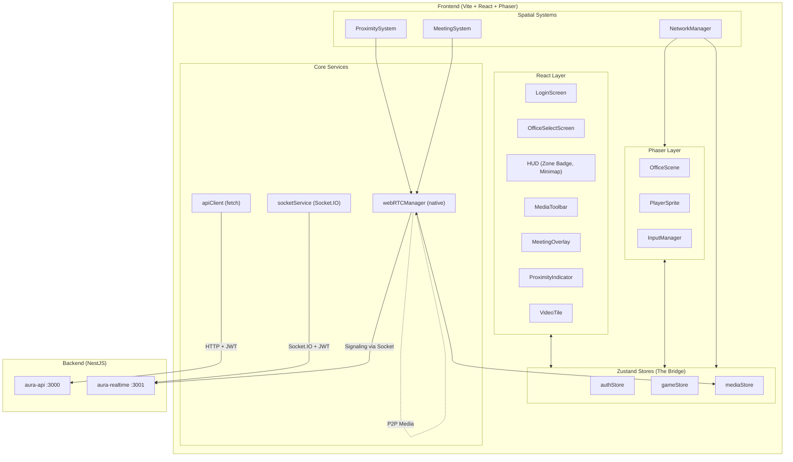
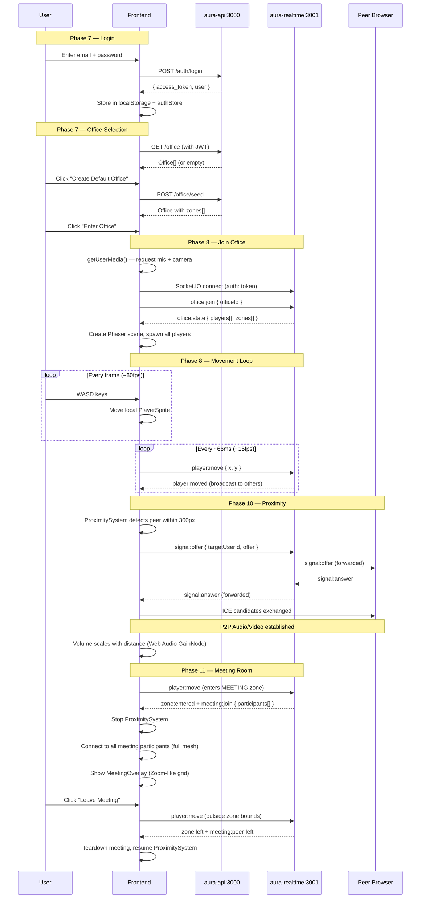

# Project Aura Frontend — Virtual Office POC Implementation Plan

## Background & Current State

The backend (Phases 1–5) is **fully complete**: Auth (register-company, login, JWT), Office CRUD + seed, WebSocket gateway (player presence, movement, zone detection, meeting lifecycle), WebRTC signaling relay, and Redis-backed state. The frontend is **scaffolded only** — all domain directories exist but are empty. This plan builds every frontend file from scratch.

| Layer | Status | Key Detail |
|---|---|---|
| Vite + React 19 + TypeScript | ✅ Configured | Port 5173, path aliases working |
| Tailwind CSS v4 + PostCSS | ✅ Configured | `@tailwindcss/postcss` adapter |
| Phaser 3.90 | ✅ Installed | No scenes or game code yet |
| Zustand 5.0.9 | ✅ Installed | No stores created yet |
| Electron wrapper | ✅ Configured | Deferred for POC — browser-only |
| All `src/core/*` directories | ⬜ Empty | api, services, store, ui, utils |
| All `src/modules/spatial/*` dirs | ⬜ Empty | entities, scenes, systems, ui |
| `src/app/` | ⬜ Empty | No screens |
| `App.tsx` | ⬜ Placeholder | Shows "Project Aura: Online" |

**Backend API Contract (already working):**

| Endpoint | Method | Auth | Response Shape |
|---|---|---|---|
| `POST /auth/register-company` | POST | None | `{ message, companyId }` |
| `POST /auth/login` | POST | None | `{ access_token, user: { id, name, role, company } }` |
| `GET /office` | GET | JWT | `Office[]` (id, name, width, height) |
| `GET /office/:id` | GET | JWT | `Office` with `zones[]` |
| `POST /office/seed` | POST | JWT | `Office` with `zones[]` (creates default layout) |

**Backend WebSocket Events (already working on port 3001):**

| Event | Direction | Payload |
|---|---|---|
| `office:join` | Client → Server | `{ officeId }` |
| `office:state` | Server → Client | `{ players: PlayerState[], zones: ZoneSnapshot[] }` |
| `player:joined` | Server → Room | `PlayerState` |
| `player:left` | Server → Room | `{ userId }` |
| `player:move` | Client → Server | `{ x, y }` |
| `player:moved` | Server → Room | `{ userId, x, y }` |
| `zone:entered` | Server → Client | `{ zoneId, zoneName, zoneType }` |
| `zone:left` | Server → Client | `{ zoneId }` |
| `meeting:join` | Server → Client | `{ zoneId, participants[] }` |
| `meeting:peer-joined` | Server → Zone | `{ userId }` |
| `meeting:peer-left` | Server → Zone | `{ userId }` |
| `signal:offer` | Bidirectional | `{ targetUserId/fromUserId, offer }` |
| `signal:answer` | Bidirectional | `{ targetUserId/fromUserId, answer }` |
| `signal:ice-candidate` | Bidirectional | `{ targetUserId/fromUserId, candidate }` |

---

## User Review Required

> [!IMPORTANT]
> **Only 1 new dependency needed**: `socket.io-client`. Everything else (WebRTC, Web Audio API, MediaDevices) is **native browser API**. Phaser and Zustand are already installed.

> [!IMPORTANT]
> **TURN Server**: For localhost POC, Google's free STUN servers work. For production deployment across NATs/firewalls, a self-hosted `coturn` TURN server will be required. This is deferred to post-POC.

> [!WARNING]
> **Electron**: Deferred for POC. All development and testing will be in-browser via `npm run dev` (Vite on port 5173).

> [!IMPORTANT]
> **Screen Sharing**: Not included in this POC plan. Achievable via `getDisplayMedia()` API but adds significant UI complexity. Recommend as a fast follow-up.

> [!NOTE]
> **Avatar Style**: POC uses colored circles with name labels (no pixel-art sprites). The backend's `avatarConfig` JSONB field exists for future customization.

---

## Proposed Changes

---

### Phase 6 — Core Infrastructure (API Client, Socket Service, Stores, Types)

This phase builds the shared foundation that every subsequent phase depends on. Zero UI — just services, stores, and type contracts.

---

#### Step 6.1 — Shared TypeScript Contracts

##### [NEW] [types.ts](file:///d:/Echofox/project-aura-fe/src/core/types.ts)

Central type definitions mirroring the backend contracts. Every other file imports from here.

```typescript
// ─── Auth ───
export interface LoginRequest {
  email: string;
  password: string;
}
export interface LoginResponse {
  access_token: string;
  user: AuthUser;
}
export interface AuthUser {
  id: string;
  name: string;
  role: string;    // "ORG_ADMIN" | "EMPLOYEE" etc.
  company: string; // company name
}
export interface JwtPayload {
  sub: string;
  email: string;
  role: string;
  companyId: string;
}

// ─── Office / Zones ───
export interface Office {
  id: string;
  name: string;
  width: number;
  height: number;
}
export enum ZoneType {
  MEETING = 'MEETING',
  FOCUS = 'FOCUS',
  LOBBY = 'LOBBY',
  PRIVATE_DESK = 'PRIVATE_DESK',
}
export interface ZoneSnapshot {
  id: string;
  name: string;
  type: ZoneType;
  x: number;
  y: number;
  width: number;
  height: number;
}

// ─── Player State (mirrors Redis PlayerState) ───
export interface PlayerState {
  socketId: string;
  userId: string;
  name: string;
  x: number;
  y: number;
  currentZoneId: string | null;
  currentZoneType: string | null;
}

// ─── Socket Event Payloads ───
export interface OfficeStatePayload {
  players: PlayerState[];
  zones: ZoneSnapshot[];
}
export interface PlayerMovedPayload {
  userId: string;
  x: number;
  y: number;
}
export interface ZoneEnteredPayload {
  zoneId: string;
  zoneName: string;
  zoneType: ZoneType;
}
export interface ZoneLeftPayload {
  zoneId: string;
}
export interface MeetingJoinPayload {
  zoneId: string;
  participants: string[];
}
export interface MeetingPeerPayload {
  userId: string;
}
export interface SignalOfferPayload {
  fromUserId: string;
  offer: RTCSessionDescriptionInit;
}
export interface SignalAnswerPayload {
  fromUserId: string;
  answer: RTCSessionDescriptionInit;
}
export interface SignalIceCandidatePayload {
  fromUserId: string;
  candidate: RTCIceCandidateInit;
}
```

**Why a single types file**: The backend's `realtime.types.ts` and `redis.types.ts` define the contract. We mirror it exactly so the frontend and backend never drift. One import path (`@core/types`) for everything.

---

#### Step 6.2 — API Client (HTTP)

##### [NEW] [api.client.ts](file:///d:/Echofox/project-aura-fe/src/core/api/api.client.ts)

Thin `fetch` wrapper for REST calls to `aura-api` on port 3000. No axios — zero dependencies.

**Key implementation details:**
- Singleton class exported as `apiClient`
- `setToken(token)` — stores JWT for subsequent requests
- `get<T>(path)` / `post<T>(path, body)` — auto-attaches `Authorization: Bearer <token>` header
- All methods throw a typed `ApiError` with status code and message on non-2xx responses
- Base URL: `http://localhost:3000` (hardcoded for POC, will be env-driven later)

**Methods used by other phases:**
- `apiClient.post<LoginResponse>('/auth/login', { email, password })`
- `apiClient.get<Office[]>('/office')`
- `apiClient.get<Office & { zones: ZoneSnapshot[] }>('/office/:id')`
- `apiClient.post<Office>('/office/seed', {})`

---

#### Step 6.3 — Socket Service (WebSocket)

##### [NEW] [socket.service.ts](file:///d:/Echofox/project-aura-fe/src/core/services/socket.service.ts)

Singleton Socket.IO client wrapping the connection to `aura-realtime` on port 3001.

**Key implementation details:**
- `connect(token: string)` — creates `io('http://localhost:3001', { auth: { token }, transports: ['websocket'] })`
- `disconnect()` — tears down the socket
- `emit(event, data?)` — type-safe emit
- `on(event, handler)` / `off(event, handler?)` — type-safe listeners
- `isConnected()` — returns connection state
- Exposes `onConnect` / `onDisconnect` / `onError` convenience wrappers
- The socket instance is **not** created until `connect()` is called (lazy)

**Dependency:** Requires `socket.io-client` package (the ONLY new npm dependency for the entire POC).

---

#### Step 6.4 — Auth Store (Zustand)

##### [NEW] [auth.store.ts](file:///d:/Echofox/project-aura-fe/src/core/store/auth.store.ts)

Zustand store managing authentication state with `localStorage` persistence.

```typescript
interface AuthState {
  // State
  token: string | null;
  user: AuthUser | null;
  isAuthenticated: boolean;
  isLoading: boolean;
  error: string | null;

  // Actions
  login: (email: string, password: string) => Promise<void>;
  logout: () => void;
  hydrate: () => void; // Check localStorage on app boot
}
```

**Key implementation details:**
- `login()` calls `apiClient.post('/auth/login', ...)`, stores token in `localStorage`, sets `apiClient.setToken(token)`, updates state
- `logout()` clears `localStorage`, disconnects socket, resets state
- `hydrate()` reads `localStorage` for existing token + user on app startup. Called once from `App.tsx`
- Error handling: catches API errors, sets `error` field for UI display
- **localStorage keys**: `aura_token`, `aura_user`

---

#### Step 6.5 — Game Store (Zustand — "The Bridge")

##### [NEW] [game.store.ts](file:///d:/Echofox/project-aura-fe/src/core/store/game.store.ts)

The critical bridge between Phaser (game engine, non-React) and React (UI overlays). Uses Zustand's `subscribeWithSelector` middleware so Phaser can subscribe to specific slices without causing React re-renders.

```typescript
interface GameState {
  // ─── Office ───
  currentOfficeId: string | null;
  officeData: { width: number; height: number; name: string } | null;
  zones: ZoneSnapshot[];

  // ─── Players ───
  players: Record<string, PlayerState>;   // keyed by userId
  localPlayerId: string | null;

  // ─── Zone Awareness ───
  currentZone: { id: string; name: string; type: ZoneType } | null;

  // ─── Meeting State ───
  inMeeting: boolean;
  meetingZoneId: string | null;
  meetingParticipants: string[];

  // ─── Actions ───
  setOffice: (id: string, data: { width: number; height: number; name: string }, zones: ZoneSnapshot[]) => void;
  setLocalPlayerId: (id: string) => void;
  addPlayer: (player: PlayerState) => void;
  removePlayer: (userId: string) => void;
  updatePlayerPosition: (userId: string, x: number, y: number) => void;
  setAllPlayers: (players: PlayerState[]) => void;
  setCurrentZone: (zone: { id: string; name: string; type: ZoneType } | null) => void;
  enterMeeting: (zoneId: string, participants: string[]) => void;
  addMeetingParticipant: (userId: string) => void;
  removeMeetingParticipant: (userId: string) => void;
  leaveMeeting: () => void;
  reset: () => void;
}
```

**Why `Record<string, PlayerState>` instead of `Map`**: Zustand's `subscribeWithSelector` and React's shallow comparison work correctly with plain objects. Maps require custom equality checks.

**Why `subscribeWithSelector`**: Phaser's `update()` loop runs at 60fps. It reads `players` directly via `getState()` (no React render). React components selectively subscribe to `currentZone`, `inMeeting`, etc. using `useGameStore(state => state.inMeeting)` — only re-rendering when their slice changes.

---

#### Step 6.6 — Media Store (Zustand)

##### [NEW] [media.store.ts](file:///d:/Echofox/project-aura-fe/src/core/store/media.store.ts)

Manages local media stream and remote peer streams. Separated from game store because media state is UI-heavy and changes independently.

```typescript
interface MediaState {
  // Local
  localStream: MediaStream | null;
  isMicOn: boolean;
  isCameraOn: boolean;
  isMediaInitialized: boolean;

  // Remote peers
  remoteStreams: Record<string, MediaStream>;  // keyed by userId

  // Actions
  initMedia: () => Promise<void>;           // getUserMedia({ audio: true, video: true })
  stopMedia: () => void;                     // Stop all tracks
  toggleMic: () => void;                     // Enable/disable audio track
  toggleCamera: () => void;                  // Enable/disable video track
  addRemoteStream: (userId: string, stream: MediaStream) => void;
  removeRemoteStream: (userId: string) => void;
  clearAllRemoteStreams: () => void;
}
```

**Key implementation details:**
- `initMedia()` calls `navigator.mediaDevices.getUserMedia({ audio: true, video: true })` — native browser API, zero dependencies
- `toggleMic()` sets `localStream.getAudioTracks()[0].enabled = !enabled` — doesn't stop/restart the stream, just mutes
- `toggleCamera()` same pattern with video tracks
- `addRemoteStream()` called by `WebRTCManager` when a peer's track arrives
- `removeRemoteStream()` called when a peer disconnects — also calls `stream.getTracks().forEach(t => t.stop())`

---

### Phase 7 — Login & Office Selection Screens

Two lightweight React screens. No Phaser involvement yet.

---

#### Step 7.1 — Login Screen

##### [NEW] [LoginScreen.tsx](file:///d:/Echofox/project-aura-fe/src/app/screens/LoginScreen.tsx)

**Visual design (dark theme, glassmorphism):**
- Full-screen dark gradient background (`#0a0a1a` → `#1a1a3e`)
- Centered glass card with `backdrop-blur-xl`, subtle border glow
- "Project Aura" branding with animated gradient text
- Email + Password inputs with floating labels
- "Sign In" button with loading spinner state
- Error message display (red toast below form)
- Subtle particle/glow animation in background (CSS-only, `@keyframes`)

**Logic:**
- Calls `useAuthStore().login(email, password)` on submit
- Shows `isLoading` spinner during API call
- Shows `error` message on failure
- On success, `isAuthenticated` becomes true → `App.tsx` automatically routes to next screen

**No registration screen for POC**: Users register via API (curl/Postman: `POST /auth/register-company`). Login screen only.

---

#### Step 7.2 — Office Selection Screen

##### [NEW] [OfficeSelectScreen.tsx](file:///d:/Echofox/project-aura-fe/src/app/screens/OfficeSelectScreen.tsx)

**Visual design:**
- Same dark theme as login
- Header bar with user name + logout button
- Card grid showing available offices
- Each card: office name, dimensions badge, "Enter Office" button with hover glow
- Empty state: "No offices yet" message + "Create Default Office" CTA button (calls `POST /office/seed`)
- Loading skeleton while fetching

**Logic flow:**
1. On mount: `apiClient.get<Office[]>('/office')` → populate list
2. If empty → show seed button → calls `apiClient.post('/office/seed', {})` → refreshes list
3. On office card click:
   - `socketService.connect(token)` — establishes WebSocket
   - Wait for socket `connect` event
   - `socketService.emit('office:join', { officeId })` — join the office
   - Listen for `office:state` response → populate `gameStore`
   - Set `gameStore.currentOfficeId` → triggers route to GameContainer

---

#### Step 7.3 — App Router

##### [MODIFY] [App.tsx](file:///d:/Echofox/project-aura-fe/src/App.tsx)

Simple state-based routing. No `react-router` dependency.

```typescript
function App() {
  const { isAuthenticated, hydrate } = useAuthStore();
  const currentOfficeId = useGameStore(s => s.currentOfficeId);

  useEffect(() => { hydrate(); }, []);

  if (!isAuthenticated) return <LoginScreen />;
  if (!currentOfficeId) return <OfficeSelectScreen />;
  return <GameContainer />;
}
```

---

### Phase 8 — Phaser Game World (The Spatial Engine)

This is the heart of the virtual office — a 2D top-down Phaser canvas where users exist as avatars. The backend sends zone/player data; Phaser renders it.

---

#### Step 8.1 — GameContainer (React ↔ Phaser Bridge)

##### [NEW] [GameContainer.tsx](file:///d:/Echofox/project-aura-fe/src/modules/spatial/ui/GameContainer.tsx)

React component that boots & destroys the Phaser `Game` instance and renders all React UI overlays on top.

**Structure:**
```
<div className="relative w-screen h-screen overflow-hidden">
  {/* Phaser canvas renders inside this div */}
  <div ref={gameContainerRef} className="absolute inset-0" />

  {/* React overlays rendered ON TOP of Phaser */}
  <HUD />
  {inMeeting && <MeetingOverlay />}
  {!inMeeting && <ProximityIndicator />}
</div>
```

**Phaser Config:**
```typescript
const config: Phaser.Types.Core.GameConfig = {
  type: Phaser.AUTO,             // WebGL with Canvas fallback
  parent: containerRef.current,
  width: window.innerWidth,
  height: window.innerHeight,
  backgroundColor: '#111827',    // Tailwind gray-900
  scene: [OfficeScene],
  physics: { default: 'arcade', arcade: { gravity: { x: 0, y: 0 } } },
  scale: {
    mode: Phaser.Scale.RESIZE,
    autoCenter: Phaser.Scale.CENTER_BOTH,
  },
};
```

**Lifecycle:**
- `useEffect` on mount → create `new Phaser.Game(config)` → store in ref
- `useEffect` cleanup → `game.destroy(true)` + `socketService.disconnect()` + `webRTCManager.disconnectAll()`
- Game instance passes data to scene via `scene.registry` or the scene reads from `gameStore.getState()` directly

---

#### Step 8.2 — OfficeScene (The Main Phaser Scene)

##### [NEW] [OfficeScene.ts](file:///d:/Echofox/project-aura-fe/src/modules/spatial/scenes/OfficeScene.ts)

The single Phaser scene that renders the entire virtual office. This is a pure TypeScript class (not React).

**`create()` method — executed once when scene starts:**

1. **Read office data** from `gameStore.getState()` — zones, dimensions, players
2. **Draw the floor**: Full-size rectangle with subtle grid pattern (20px grid lines, very faint)
3. **Draw zones** as colored rectangles with labels:
   - `LOBBY` → `#1e293b` fill, `#475569` dashed border, "🏢 Lobby" label
   - `PRIVATE_DESK` → `#1e3a5f` fill, `#3b82f6` solid border, desk name label, small desk icon (drawn with Graphics)
   - `MEETING` → `#3f1f0e` fill, `#f59e0b` solid border with rounded corners, "📹" icon + room name
4. **Create local player** — `PlayerSprite` instance at spawn position (lobby center)
5. **Create remote players** — iterate `gameStore.players`, create `PlayerSprite` for each
6. **Setup camera** — follow local player, bounded to office dimensions, 0.1 lerp for smooth follow
7. **Setup input** — `InputManager` instance for WASD/Arrow key handling
8. **Setup networking** — `NetworkManager` instance to listen for socket events
9. **Start proximity system** — `ProximitySystem.start()` (Phase 10)

**`update(time, delta)` method — called every frame (~60fps):**

1. **Read input** → `inputManager.getVelocity()` returns `{ vx, vy }` (normalized, speed = 200 px/sec)
2. **Move local player** → `localPlayer.setPosition(x + vx * delta, y + vy * delta)`
3. **Clamp position** to office bounds (0 to width, 0 to height)
4. **Emit position** → `networkManager.emitMove(x, y)` (throttled internally to ~15fps)
5. **Update remote players** → each `PlayerSprite` updates its lerp interpolation

**Zone visual layout (2000×1500 canvas as seeded by the backend):**
```
┌──────────────────────────────────────────────────────────────────┐
│  LOBBY (800×500)              │ Huddle Room (400×350)│ Gathering │
│  Spawn point ★               │ 📹 MEETING          │ Space     │
│                               │                     │ 📹 MEETING│
│                               │                     │ (450×400) │
├───────┬───────┬───────────────┼─────────────────────┤           │
│Desk-A │Desk-B │Desk-C         │                     │           │
│200×200│200×200│200×200        │ Conference Room     │           │
├───────┼───────┼───────────────│ 📹 MEETING          │           │
│Desk-D │Desk-E │Desk-F         │ (500×450)           │           │
│200×200│200×200│200×200        │                     │           │
└───────┴───────┴───────────────┴─────────────────────┴───────────┘
```

---

#### Step 8.3 — PlayerSprite

##### [NEW] [PlayerSprite.ts](file:///d:/Echofox/project-aura-fe/src/modules/spatial/entities/PlayerSprite.ts)

Represents a player in the Phaser world. Pure Phaser GameObjects — no React.

**Visual composition (3 layered objects):**
1. **Body circle** — `Phaser.GameObjects.Arc` (radius 16px)
   - Local player: bright cyan `#06b6d4`
   - Remote player: color derived from `userId.charCodeAt()` hash → consistent per user
2. **Name label** — `Phaser.GameObjects.Text` above the circle (12px, white, center-aligned)
3. **Status dot** — small `Arc` (radius 4px) at bottom-right of body, green = online

**Position interpolation for remote players:**
```typescript
// Called every frame for remote players
updatePosition(targetX: number, targetY: number, delta: number) {
  const lerpFactor = 0.15; // Smooth interpolation
  this.x = Phaser.Math.Linear(this.x, targetX, lerpFactor);
  this.y = Phaser.Math.Linear(this.y, targetY, lerpFactor);
  // Name label and status dot follow
  this.nameLabel.setPosition(this.x, this.y - 28);
  this.statusDot.setPosition(this.x + 12, this.y + 12);
}
```

**Local player** has no lerp — position is set directly from input.

**Methods:**
- `constructor(scene, userId, name, x, y, isLocal)` — creates all 3 objects, adds to scene
- `setTargetPosition(x, y)` — sets interpolation target (remote only)
- `update(delta)` — runs lerp (remote only)
- `setZoneIndicator(zoneName)` — subtle text below name showing current zone
- `destroy()` — removes all objects from scene

---

#### Step 8.4 — InputManager

##### [NEW] [InputManager.ts](file:///d:/Echofox/project-aura-fe/src/modules/spatial/systems/InputManager.ts)

Encapsulates keyboard input handling. Pure Phaser — no dependencies.

**Supported keys:**
- WASD + Arrow keys for movement
- Computes normalized direction vector × speed (200 px/sec)
- Returns `{ vx: number, vy: number }` each frame
- Diagonal movement is normalized so speed is consistent

```typescript
class InputManager {
  private keys: {
    W: Phaser.Input.Keyboard.Key;
    A: Phaser.Input.Keyboard.Key;
    S: Phaser.Input.Keyboard.Key;
    D: Phaser.Input.Keyboard.Key;
    UP: Phaser.Input.Keyboard.Key;
    DOWN: Phaser.Input.Keyboard.Key;
    LEFT: Phaser.Input.Keyboard.Key;
    RIGHT: Phaser.Input.Keyboard.Key;
  };
  private speed = 200; // pixels per second

  constructor(scene: Phaser.Scene);
  getVelocity(): { vx: number; vy: number };
  destroy(): void;
}
```

---

#### Step 8.5 — NetworkManager

##### [NEW] [NetworkManager.ts](file:///d:/Echofox/project-aura-fe/src/modules/spatial/systems/NetworkManager.ts)

Bridges Socket.IO events and the Phaser scene. Listens for all server events and updates either the scene (spawning/removing sprites) or `gameStore`.

**Socket events handled:**

| Event | Handler Logic |
|---|---|
| `player:joined` | Create new `PlayerSprite` in scene, add to `gameStore.addPlayer()` |
| `player:left` | Destroy `PlayerSprite`, call `gameStore.removePlayer()`, cleanup WebRTC peer |
| `player:moved` | Update `PlayerSprite` target position, update `gameStore.updatePlayerPosition()` |
| `zone:entered` | Update `gameStore.setCurrentZone()` — React HUD shows zone badge |
| `zone:left` | `gameStore.setCurrentZone(null)` |
| `meeting:join` | `gameStore.enterMeeting(zoneId, participants)` — triggers MeetingSystem |
| `meeting:peer-joined` | `gameStore.addMeetingParticipant(userId)` — MeetingSystem connects |
| `meeting:peer-left` | `gameStore.removeMeetingParticipant(userId)` — MeetingSystem disconnects |
| `signal:offer` | Forward to `webRTCManager.handleOffer()` |
| `signal:answer` | Forward to `webRTCManager.handleAnswer()` |
| `signal:ice-candidate` | Forward to `webRTCManager.handleIceCandidate()` |

**Position emission throttling:**
```typescript
private lastEmitTime = 0;
private readonly EMIT_INTERVAL = 66; // ~15fps

emitMove(x: number, y: number) {
  const now = Date.now();
  if (now - this.lastEmitTime < this.EMIT_INTERVAL) return;
  this.lastEmitTime = now;
  socketService.emit('player:move', { x, y });
}
```

**Lifecycle:**
- `init()` — register all socket listeners, called from `OfficeScene.create()`
- `destroy()` — unregister all socket listeners, called from `OfficeScene.shutdown()`

---

### Phase 9 — HUD & React Overlays

React components rendered on top of the Phaser canvas. They read from Zustand stores and never touch Phaser directly.

---

#### Step 9.1 — HUD (Main Overlay)

##### [NEW] [HUD.tsx](file:///d:/Echofox/project-aura-fe/src/modules/spatial/ui/HUD.tsx)

Floating UI layer with absolute positioning over the game canvas.

**Layout:**
```
┌──────────────────────────────────────────────────────────┐
│ [📍 Conference Room]                    [UserName] [⚙️]  │
│                                                          │
│                                                          │
│                     (Phaser Canvas)                       │
│                                                          │
│                                                          │
│                                                [Minimap] │
│         [🎤 Mic] [📹 Camera] [👥 N online]              │
└──────────────────────────────────────────────────────────┘
```

**Components within HUD:**
- **Top-left**: `ZoneBadge` — shows current zone name + icon (📍), animated slide-in/out
- **Top-right**: User info pill (name + avatar circle), settings gear icon
- **Bottom-center**: `MediaToolbar` — mic/camera toggle buttons
- **Bottom-right**: `Minimap` — scaled-down office overview
- **Bottom-left**: Player count "👥 N online"

**All elements use:**
- `pointer-events: none` on the container, `pointer-events: auto` on interactive elements — so clicks pass through to Phaser
- Glassmorphism styling: `bg-black/30 backdrop-blur-md border border-white/10 rounded-xl`
- Subtle entrance animations (`animate-fadeIn`, `animate-slideUp`)

---

#### Step 9.2 — MediaToolbar

##### [NEW] [MediaToolbar.tsx](file:///d:/Echofox/project-aura-fe/src/modules/spatial/ui/MediaToolbar.tsx)

Floating toolbar at the bottom center of the screen.

**Buttons:**
1. **Mic toggle** — Green microphone icon when on, red slash when muted. Calls `mediaStore.toggleMic()`
2. **Camera toggle** — Same pattern. Calls `mediaStore.toggleCamera()`
3. **Visual feedback**: Active = green ring pulse, muted = red background

**Styling:**
- Pill-shaped container `rounded-full bg-black/50 backdrop-blur-lg`
- Each button: 48px circle, icon centered, hover scale effect
- Smooth color transition on toggle (`transition-colors duration-200`)

---

#### Step 9.3 — Minimap

##### [NEW] [Minimap.tsx](file:///d:/Echofox/project-aura-fe/src/modules/spatial/ui/Minimap.tsx)

Small interactive canvas in the bottom-right corner showing a bird's-eye view.

**Implementation:**
- HTML `<canvas>` element (200×150px), drawn with 2D context
- Scale factor: `200/2000 = 0.1` (office width → minimap width)
- Draws:
  - Zone rectangles with type-based colors (same scheme as Phaser but lighter)
  - All player dots (4px circles, colored by user)
  - Local player dot highlighted (larger, pulsing cyan)
  - Zone labels in micro text (8px)
- Redraws on a `requestAnimationFrame` loop (or throttled to 10fps)
- Reads player positions from `gameStore.getState().players`

**Styling:**
- `rounded-lg border border-white/20 bg-black/40 backdrop-blur-sm`
- Subtle shadow and glow effect on hover

---

### Phase 10 — WebRTC Media Layer (Native — Zero Dependencies)

This phase implements proximity-based audio/video and meeting room conferencing using **only native browser APIs**: `RTCPeerConnection`, `MediaStream`, `Web Audio API`.

---

#### Step 10.1 — WebRTCManager

##### [NEW] [webrtc.manager.ts](file:///d:/Echofox/project-aura-fe/src/core/services/webrtc.manager.ts)

Central singleton managing all `RTCPeerConnection` instances. One connection per remote peer.

**ICE Configuration (STUN only for POC):**
```typescript
private readonly ICE_CONFIG: RTCConfiguration = {
  iceServers: [
    { urls: 'stun:stun.l.google.com:19302' },
    { urls: 'stun:stun1.l.google.com:19302' },
  ],
};
```

**Internal state:**
```typescript
private peers: Map<string, RTCPeerConnection> = new Map();
private audioContexts: Map<string, { ctx: AudioContext; gain: GainNode }> = new Map();
```

**Core methods:**

| Method | Description |
|---|---|
| `setLocalStream(stream)` | Stores the local `MediaStream` from `mediaStore` |
| `connectToPeer(targetUserId)` | Creates `RTCPeerConnection`, adds local tracks, creates SDP offer, emits `signal:offer` via socket |
| `handleOffer(fromUserId, offer)` | Creates peer connection (if needed), sets remote description, adds local tracks, creates answer, emits `signal:answer` |
| `handleAnswer(fromUserId, answer)` | Sets remote description on existing peer |
| `handleIceCandidate(fromUserId, candidate)` | Adds ICE candidate to existing peer |
| `disconnectPeer(userId)` | Closes `RTCPeerConnection`, removes from map, calls `mediaStore.removeRemoteStream(userId)`, cleans up audio context |
| `disconnectAll()` | Disconnects every peer — used when leaving office |
| `setAudioVolume(userId, volume)` | Sets `GainNode.gain.value` for a specific peer (0.0 to 1.0) — used by ProximitySystem |

**RTCPeerConnection lifecycle (for `connectToPeer`):**
```
1. const pc = new RTCPeerConnection(ICE_CONFIG)
2. localStream.getTracks().forEach(track => pc.addTrack(track, localStream))
3. pc.ontrack = (event) => {
     mediaStore.addRemoteStream(userId, event.streams[0]);
     setupAudioGainNode(userId, event.streams[0]); // For proximity volume
   }
4. pc.onicecandidate = (event) => {
     if (event.candidate) {
       socketService.emit('signal:ice-candidate', { targetUserId, candidate: event.candidate });
     }
   }
5. pc.onconnectionstatechange = () => {
     if (pc.connectionState === 'failed' || pc.connectionState === 'disconnected') {
       this.disconnectPeer(userId);
     }
   }
6. const offer = await pc.createOffer();
7. await pc.setLocalDescription(offer);
8. socketService.emit('signal:offer', { targetUserId, offer });
```

**Web Audio API for proximity volume control:**
```typescript
private setupAudioGainNode(userId: string, remoteStream: MediaStream) {
  const audioCtx = new AudioContext();
  const source = audioCtx.createMediaStreamSource(remoteStream);
  const gainNode = audioCtx.createGain();
  gainNode.gain.value = 1.0; // Full volume initially
  source.connect(gainNode);
  gainNode.connect(audioCtx.destination);
  this.audioContexts.set(userId, { ctx: audioCtx, gain: gainNode });
}

setAudioVolume(userId: string, volume: number) {
  const entry = this.audioContexts.get(userId);
  if (entry) {
    entry.gain.gain.setTargetAtTime(volume, entry.ctx.currentTime, 0.1);
    // setTargetAtTime for smooth ramping instead of clicks/pops
  }
}
```

---

#### Step 10.2 — ProximitySystem

##### [NEW] [ProximitySystem.ts](file:///d:/Echofox/project-aura-fe/src/modules/spatial/systems/ProximitySystem.ts)

Runs on a 500ms interval. Evaluates which remote players are within range and manages WebRTC connections + volume accordingly.

**Constants:**
```typescript
PROXIMITY_RADIUS = 300     // px — start hearing at this distance
FULL_VOLUME_RADIUS = 50    // px — max volume when this close
CHECK_INTERVAL = 500       // ms — evaluation frequency
```

**Algorithm (every 500ms):**
```
1. Get local player position from gameStore
2. Get current zone from gameStore
3. IF in a MEETING zone → skip (meeting system handles connections)
4. FOR each remote player in gameStore.players:
   a. Calculate euclidean distance
   b. IF distance ≤ PROXIMITY_RADIUS AND not already connected:
      → webRTCManager.connectToPeer(userId)
      → add to connectedPeers set
   c. IF distance > PROXIMITY_RADIUS AND currently connected:
      → webRTCManager.disconnectPeer(userId)
      → remove from connectedPeers set
   d. IF connected:
      → volume = calculateVolume(distance)
      → webRTCManager.setAudioVolume(userId, volume)
```

**Volume curve (linear falloff):**
```typescript
calculateVolume(distance: number): number {
  if (distance <= FULL_VOLUME_RADIUS) return 1.0;
  if (distance >= PROXIMITY_RADIUS) return 0.0;
  return 1.0 - (distance - FULL_VOLUME_RADIUS) / (PROXIMITY_RADIUS - FULL_VOLUME_RADIUS);
}
```

**Lifecycle:**
- `start()` → `setInterval(evaluate, CHECK_INTERVAL)` — called from `OfficeScene.create()`
- `stop()` → `clearInterval` — called from MeetingSystem when entering a meeting
- `resume()` → restart interval — called when leaving a meeting

---

#### Step 10.3 — MeetingSystem

##### [NEW] [MeetingSystem.ts](file:///d:/Echofox/project-aura-fe/src/modules/spatial/systems/MeetingSystem.ts)

Manages the transition from open-office proximity mode to closed-room conferencing mode. Activated by socket events, not by position polling.

**Trigger:** `NetworkManager` receives `meeting:join` event from server (server detected player entered a MEETING zone).

**`handleMeetingJoin(zoneId, existingParticipants)`:**
1. Stop `ProximitySystem` (proximity logic disabled inside meetings)
2. Disconnect all current proximity peers (`webRTCManager.disconnectAll()`)
3. For each participant in `existingParticipants` → `webRTCManager.connectToPeer(userId)` at full volume
4. Update `gameStore.enterMeeting(zoneId, existingParticipants)`
5. React `MeetingOverlay` auto-renders (reads `gameStore.inMeeting`)

**`handlePeerJoined(userId)`:**
1. `webRTCManager.connectToPeer(userId)` — full volume (no distance-based attenuation)
2. `gameStore.addMeetingParticipant(userId)`

**`handlePeerLeft(userId)`:**
1. `webRTCManager.disconnectPeer(userId)`
2. `gameStore.removeMeetingParticipant(userId)`

**`handleMeetingLeave()` (triggered by `zone:left` with meeting zone):**
1. `webRTCManager.disconnectAll()` — tear down all meeting connections
2. `gameStore.leaveMeeting()`
3. Resume `ProximitySystem` — re-evaluates who's nearby
4. React `MeetingOverlay` auto-hides

---

### Phase 11 — Meeting Room UI (Zoom-like Experience)

When `gameStore.inMeeting === true`, a React overlay renders over the Phaser canvas, showing a grid of video tiles — exactly like Zoom/Google Meet.

---

#### Step 11.1 — MeetingOverlay

##### [NEW] [MeetingOverlay.tsx](file:///d:/Echofox/project-aura-fe/src/modules/spatial/ui/MeetingOverlay.tsx)

Full-screen semi-transparent overlay that renders when the user is in a meeting zone.

**Visual layout:**
```
┌──────────────────────────────────────────────────────────┐
│                 📹 Conference Room                        │
│  ┌──────────┐  ┌──────────┐  ┌──────────┐               │
│  │ Video 1  │  │ Video 2  │  │ Video 3  │               │
│  │ Alice    │  │ Bob      │  │ Charlie  │               │
│  └──────────┘  └──────────┘  └──────────┘               │
│                                                          │
│                                          ┌────────┐      │
│                                          │ Self   │      │
│                                          │ (small)│      │
│                                          └────────┘      │
│         [🎤] [📹] [🚪 Leave Meeting]                     │
└──────────────────────────────────────────────────────────┘
```

**Grid layout logic (responsive):**
- 1 participant: full width single tile
- 2 participants: 50/50 split
- 3-4 participants: 2×2 grid
- 5-6 participants: 3×2 grid
- 7+ participants: scrollable grid with max 3 columns

**Implementation:**
- `CSS Grid` with dynamic `grid-template-columns` based on participant count
- Self-view: fixed position bottom-right, smaller (200×150px), mirrored (`transform: scaleX(-1)`)
- Controls bar: fixed bottom center, same style as `MediaToolbar` but with added "Leave Meeting" button
- "Leave Meeting" button: red, walks avatar out of the zone (emits `player:move` to a position outside the zone bounds)
- Background: `bg-black/80 backdrop-blur-md` — game world visible but dimmed

**Data flow:**
- Reads `gameStore.meetingParticipants` for the list of user IDs
- Reads `mediaStore.remoteStreams` to get each participant's `MediaStream`
- Reads `gameStore.players[userId].name` for participant names

---

#### Step 11.2 — VideoTile

##### [NEW] [VideoTile.tsx](file:///d:/Echofox/project-aura-fe/src/modules/spatial/ui/VideoTile.tsx)

Reusable video tile component used in both `MeetingOverlay` and `ProximityIndicator`.

**Props:**
```typescript
interface VideoTileProps {
  stream: MediaStream | null;
  userName: string;
  isMuted: boolean;
  isLocal?: boolean;      // mirrors video if true
  size?: 'sm' | 'md' | 'lg';
  shape?: 'rect' | 'circle';  // rect for meetings, circle for proximity
}
```

**Features:**
- `<video>` element with `ref` — attaches stream via `useEffect(() => { videoRef.srcObject = stream; })`
- `autoPlay`, `playsInline`, `muted={isLocal}` (local is always muted to prevent echo)
- Camera-off fallback: shows a colored circle with user initials (first letter of first + last name)
- Name label overlay at bottom of tile
- Mute indicator: small red microphone-slash icon in top-right corner when muted
- **Speaking indicator**: subtle border glow animation when audio is active (uses `AnalyserNode` from Web Audio API to detect audio levels > threshold)
- Smooth entrance animation (`animate-scaleIn`)

**Speaking detection (native API):**
```typescript
// Inside VideoTile, for non-local streams:
const analyser = audioCtx.createAnalyser();
source.connect(analyser);
const dataArray = new Uint8Array(analyser.frequencyBinCount);

function checkAudio() {
  analyser.getByteFrequencyData(dataArray);
  const average = dataArray.reduce((a, b) => a + b) / dataArray.length;
  setIsSpeaking(average > 15); // threshold
  requestAnimationFrame(checkAudio);
}
```

---

#### Step 11.3 — ProximityIndicator

##### [NEW] [ProximityIndicator.tsx](file:///d:/Echofox/project-aura-fe/src/modules/spatial/ui/ProximityIndicator.tsx)

When NOT in a meeting, shows small floating circular video bubbles for nearby users whose WebRTC connections are active.

**Visual:**
- Row of circular video thumbnails at the bottom of the screen (above MediaToolbar)
- Each bubble: 72px circle, `border-radius: 50%`, subtle glow
- Opacity tied to distance: closer = more opaque (reads from ProximitySystem's volume value)
- Smooth fade-in/fade-out on appear/disappear (`transition-opacity duration-500`)
- User name tooltip on hover
- Mute indicator dot

**Data source:**
- Reads `mediaStore.remoteStreams` — only shows users who have an active stream
- Uses `VideoTile` component with `shape="circle"` and `size="sm"`

---

### Phase 12 — Integration, Polish & Final Wiring

---

#### Step 12.1 — Install Socket.IO Client

```bash
cd D:\Echofox\project-aura-fe
npm install socket.io-client
```

This is the **only** new package. Everything else (WebRTC, Web Audio, Canvas) is native.

---

#### Step 12.2 — CSS Foundation

##### [MODIFY] [index.css](file:///d:/Echofox/project-aura-fe/src/index.css)

Add custom CSS utilities, animations, and the Google Font import:

```css
@import url('https://fonts.googleapis.com/css2?family=Inter:wght@300;400;500;600;700&display=swap');

@tailwind base;
@tailwind components;
@tailwind utilities;

html, body, #root {
  height: 100%;
  width: 100%;
  margin: 0;
  padding: 0;
  overflow: hidden;
  font-family: 'Inter', system-ui, sans-serif;
}

/* ─── Custom Animations ─── */
@keyframes fadeIn { from { opacity: 0; } to { opacity: 1; } }
@keyframes slideUp { from { transform: translateY(20px); opacity: 0; } to { transform: translateY(0); opacity: 1; } }
@keyframes scaleIn { from { transform: scale(0.8); opacity: 0; } to { transform: scale(1); opacity: 1; } }
@keyframes pulse-glow { 0%, 100% { box-shadow: 0 0 5px currentColor; } 50% { box-shadow: 0 0 20px currentColor; } }
@keyframes gradient-shift { 0% { background-position: 0% 50%; } 50% { background-position: 100% 50%; } 100% { background-position: 0% 50%; } }

.animate-fadeIn { animation: fadeIn 0.3s ease-out; }
.animate-slideUp { animation: slideUp 0.4s ease-out; }
.animate-scaleIn { animation: scaleIn 0.3s ease-out; }
.animate-pulse-glow { animation: pulse-glow 2s ease-in-out infinite; }
.animate-gradient { animation: gradient-shift 3s ease infinite; background-size: 200% 200%; }

/* ─── Glass Morphism Utility ─── */
.glass { @apply bg-black/30 backdrop-blur-md border border-white/10 rounded-xl; }
.glass-dark { @apply bg-black/60 backdrop-blur-lg border border-white/5 rounded-xl; }
```

---

#### Step 12.3 — Media Initialization Flow

**When does media start?**
- Media is **NOT** initialized on login
- Media initializes when the user enters the office (in `GameContainer.tsx` mount):
  1. `await mediaStore.initMedia()` — requests camera + mic permission
  2. `webRTCManager.setLocalStream(mediaStore.localStream)`
  3. If permission denied → show toast, continue without media (game still works, just no audio/video)

**This ensures:**
- No annoying permission popups on login
- Media is ready before any WebRTC connections are attempted

---

#### Step 12.4 — Leaving / Disconnecting

**"Leave Meeting" button in MeetingOverlay:**
1. Calculate a position just outside the current meeting zone bounds
2. Emit `player:move` to that position
3. Server detects zone exit → emits `zone:left` + `meeting:peer-left`
4. Client's NetworkManager handles the events → MeetingSystem cleans up

**Browser tab close / navigate away:**
- `window.addEventListener('beforeunload', ...)` in `GameContainer`
- Calls `socketService.disconnect()` → server's `handleDisconnect` cleans up Redis
- Calls `webRTCManager.disconnectAll()`
- Calls `mediaStore.stopMedia()`

**Logout:**
- `authStore.logout()` → clears token, disconnects socket, resets all stores

---

## Complete File Manifest

### New Files (21 files)

| # | Path | Phase | Description |
|---|---|---|---|
| 1 | `src/core/types.ts` | 6.1 | Shared TypeScript contracts |
| 2 | `src/core/api/api.client.ts` | 6.2 | HTTP client for REST API |
| 3 | `src/core/services/socket.service.ts` | 6.3 | Socket.IO client wrapper |
| 4 | `src/core/store/auth.store.ts` | 6.4 | Auth state + localStorage |
| 5 | `src/core/store/game.store.ts` | 6.5 | Game state (The Bridge) |
| 6 | `src/core/store/media.store.ts` | 6.6 | Media stream state |
| 7 | `src/app/screens/LoginScreen.tsx` | 7.1 | Login form UI |
| 8 | `src/app/screens/OfficeSelectScreen.tsx` | 7.2 | Office lobby UI |
| 9 | `src/modules/spatial/ui/GameContainer.tsx` | 8.1 | Phaser ↔ React bridge |
| 10 | `src/modules/spatial/scenes/OfficeScene.ts` | 8.2 | Main Phaser scene |
| 11 | `src/modules/spatial/entities/PlayerSprite.ts` | 8.3 | Player visual entity |
| 12 | `src/modules/spatial/systems/InputManager.ts` | 8.4 | Keyboard input handler |
| 13 | `src/modules/spatial/systems/NetworkManager.ts` | 8.5 | Socket ↔ Phaser bridge |
| 14 | `src/modules/spatial/ui/HUD.tsx` | 9.1 | Main overlay layout |
| 15 | `src/modules/spatial/ui/MediaToolbar.tsx` | 9.2 | Mic/camera controls |
| 16 | `src/modules/spatial/ui/Minimap.tsx` | 9.3 | Bird's eye view |
| 17 | `src/core/services/webrtc.manager.ts` | 10.1 | WebRTC peer management |
| 18 | `src/modules/spatial/systems/ProximitySystem.ts` | 10.2 | Distance-based connections |
| 19 | `src/modules/spatial/systems/MeetingSystem.ts` | 10.3 | Meeting room logic |
| 20 | `src/modules/spatial/ui/MeetingOverlay.tsx` | 11.1 | Zoom-like meeting UI |
| 21 | `src/modules/spatial/ui/VideoTile.tsx` | 11.2 | Reusable video component |
| 22 | `src/modules/spatial/ui/ProximityIndicator.tsx` | 11.3 | Floating video bubbles |

### Modified Files (2 files)

| # | Path | Phase | Change |
|---|---|---|---|
| 1 | `src/App.tsx` | 7.3 | State-based routing |
| 2 | `src/index.css` | 12.2 | Animations, fonts, glass utilities |

### New Dependencies (1 package)

| Package | Version | Purpose |
|---|---|---|
| `socket.io-client` | `^4.x` | Socket.IO client for WebSocket communication |

---

## Architecture Diagram



---

## Data Flow: Full User Journey



---

## Execution Order (Build Sequence)

| Order | Phase | Files | Dependencies |
|---|---|---|---|
| 1 | 12.1 | `npm install socket.io-client` | — |
| 2 | 12.2 | `index.css` | — |
| 3 | 6.1 | `types.ts` | — |
| 4 | 6.2 | `api.client.ts` | types.ts |
| 5 | 6.3 | `socket.service.ts` | socket.io-client |
| 6 | 6.4 | `auth.store.ts` | api.client, types |
| 7 | 6.5 | `game.store.ts` | types |
| 8 | 6.6 | `media.store.ts` | — |
| 9 | 10.1 | `webrtc.manager.ts` | socket.service, media.store |
| 10 | 7.1 | `LoginScreen.tsx` | auth.store |
| 11 | 7.2 | `OfficeSelectScreen.tsx` | auth.store, api.client, socket.service, game.store |
| 12 | 7.3 | `App.tsx` (modify) | auth.store, game.store |
| 13 | 8.3 | `PlayerSprite.ts` | — (pure Phaser) |
| 14 | 8.4 | `InputManager.ts` | — (pure Phaser) |
| 15 | 10.2 | `ProximitySystem.ts` | game.store, webrtc.manager |
| 16 | 10.3 | `MeetingSystem.ts` | game.store, webrtc.manager, ProximitySystem |
| 17 | 8.5 | `NetworkManager.ts` | socket.service, game.store, webrtc.manager, MeetingSystem |
| 18 | 8.2 | `OfficeScene.ts` | PlayerSprite, InputManager, NetworkManager, ProximitySystem |
| 19 | 11.2 | `VideoTile.tsx` | media.store |
| 20 | 9.2 | `MediaToolbar.tsx` | media.store |
| 21 | 9.3 | `Minimap.tsx` | game.store |
| 22 | 9.1 | `HUD.tsx` | game.store, MediaToolbar, Minimap |
| 23 | 11.3 | `ProximityIndicator.tsx` | media.store, VideoTile |
| 24 | 11.1 | `MeetingOverlay.tsx` | game.store, media.store, VideoTile |
| 25 | 8.1 | `GameContainer.tsx` | OfficeScene, HUD, MeetingOverlay, ProximityIndicator, media.store, webrtc.manager |

---

## Verification Plan

### Automated Build Check

```bash
cd D:\Echofox\project-aura-fe
npm run dev  # Must compile without errors on port 5173
```

### Backend Prerequisites (must be running)

```bash
cd D:\Echofox\project-aura
# Terminal 1: Docker (Postgres + Redis)
docker-compose up -d

# Terminal 2: API server
npx nest start aura-api --watch    # Port 3000

# Terminal 3: Realtime server
npx nest start aura-realtime --watch  # Port 3001
```

### Manual Test Scenarios

| # | Test | Steps | Expected |
|---|---|---|---|
| 1 | **Login Flow** | Enter valid email/password → click Sign In | JWT stored, redirected to office select |
| 2 | **Office Seed** | Click "Create Default Office" | Office card appears with "HQ Office" |
| 3 | **Enter Office** | Click office card | Phaser canvas loads, avatar spawns in lobby |
| 4 | **Movement** | Press WASD/arrows | Avatar moves smoothly, zone badges appear/disappear |
| 5 | **Multiplayer** | Open 2 tabs, login as 2 users | Both avatars visible, movement synced |
| 6 | **Proximity Audio** | Walk avatars within 300px | WebRTC connects, audio heard |
| 7 | **Proximity Falloff** | Walk avatars apart | Volume decreases, disconnects at >300px |
| 8 | **Meeting Entry** | Both walk into Conference Room | MeetingOverlay appears, video grid shows |
| 9 | **Meeting Exit** | One clicks "Leave Meeting" | Overlay hides, proximity resumes |
| 10 | **Disconnect** | Close one tab | Other tab sees avatar disappear, media cleans up |

### Debug Tools

- **Chrome DevTools → Network → WS tab**: Inspect Socket.IO frames
- **`chrome://webrtc-internals`**: Monitor all RTCPeerConnection stats, ICE candidates, track bitrates
- **Console logging**: All managers/systems log lifecycle events (`[WebRTC]`, `[Proximity]`, `[Meeting]`, `[Network]`)

---

## Open Questions

> [!IMPORTANT]
> **Player Collisions**: Should players collide with zone walls or each other? The current plan has no collisions (players can walk freely anywhere). Enabling collisions adds complexity with Phaser Arcade physics. **Recommend: no collisions for POC.**

> [!NOTE]
> **Reconnection**: If the WebSocket disconnects (network glitch), should the client auto-reconnect and re-join the office? Socket.IO has built-in reconnection, but re-joining the office room requires re-emitting `office:join`. **Recommend: implement basic auto-reconnect in a fast follow-up.**

> [!NOTE]
> **Mobile/Touch**: The POC is desktop-only (WASD/arrow keys). Touch controls for mobile would require a virtual joystick overlay. **Recommend: defer to post-POC.**
